# Lean Canvas — Plataforma ATS B2B (multi‑país)

## Diagrama (vista Lean Canvas)

```mermaid
flowchart TB
  subgraph L1["Fila superior — propuesta y mercado"]
    direction LR
    subgraph PROB["Problema"]
      direction TB
      p1["Procesos dispersos\n(sin fuente única de verdad)"]
      p2["Poca trazabilidad para\nauditoría y cumplimiento"]
      p3["Mala experiencia candidata\n(opacidad, silencios)"]
    end
    subgraph SOL["Solución"]
      direction TB
      s1["Vacantes + embudo +\nhistorial completo"]
      s2["Clonar / reabrir vacantes"]
      s3["Perfil candidato estable +\nintegraciones vía adaptadores"]
    end
    subgraph UVP["Propuesta de valor única"]
      direction TB
      u1["Decisiones defendibles +\ncandidatos con claridad"]
      u2["Multi‑país: privacidad,\nidioma y operación"]
    end
    subgraph VENT["Ventaja / moat (evolución)"]
      direction TB
      v1["Auditoría y eventos\nde dominio nativos"]
      v2["Posicionamiento dual\nempresa + candidato"]
    end
    subgraph SEG["Segmentos"]
      direction TB
      seg1["PYMEs / scale‑ups\ncon contratación recurrente"]
      seg2["Early adopters:\n2–8 reclutadores, multi‑país"]
    end
  end

  subgraph L2["Fila inferior — métricas, canales, economía"]
    direction LR
    subgraph MET["Métricas clave"]
      direction TB
      m1["MRR / ARPA"]
      m2["Vacantes activas y\ncandidaturas / mes"]
      m3["Time‑to‑hire y\nNPS candidato"]
    end
    subgraph CAN["Canales"]
      direction TB
      c1["Outbound + partners\n(consultoras RH, EOR)"]
      c2["Contenido / SEO +\ncomunidad talento"]
    end
    subgraph ALT["Alternativas"]
      direction TB
      a1["Excel + email +\ncalendar suelto"]
      a2["ATS genérico o solo\nportales (LinkedIn/Indeed)"]
    end
    subgraph ECO["Economía"]
      direction TB
      e1["Costes: cloud OCI,\nequipo, compliance"]
      e2["Ingresos: SaaS por org\n/ vacante / asiento + add‑ons"]
    end
  end

  PROB --> UVP
  SOL --> UVP
  VENT --> UVP
  SEG --> UVP
  MET --> ECO
  CAN --> SEG
  ALT --> PROB
```

---

## Lienzo en formato tabla (layout Ash Maurya)

<table>
  <tr>
    <td valign="top" width="18%"><b>Problema</b>  • Reclutamiento en <b>herramientas sueltas</b> (hojas de cálculo, correo, mensajería) sin historial único ni continuidad cuando cambia el equipo. • Dificultad para <b>justificar decisiones</b> y demostrar trato equitativo ante auditorías internas o RGPD. • <b>Experiencia candidata</b> opaca: estados desactualizados, silencios y duplicación de datos entre portales.</td>
    <td valign="top" width="18%"><b>Solución</b>  • <b>ATS B2B</b>: vacantes con embudo, etapas explícitas, notas internas separadas de lo que ve el candidato. • <b>Historial completo</b> (éxito o fracaso), <b>clonar</b> vacantes y <b>reabrir</b> cerradas con trazabilidad. • <b>Candidatos sin coste</b>: perfil estable, multipostulación; <b>compromiso de veracidad</b> como señal de confianza. • <b>Integraciones</b> (email, calendario, assessments, HRIS, verificación) desacopladas por capa de adaptadores.</td>
    <td valign="top" width="20%" rowspan="2"><b>Propuesta de valor única</b>  <i>«Orden y memoria institucional del reclutamiento, con trato claro al candidato —pensado para operar en varios países desde el diseño de datos y privacidad.»</i>  <b>High‑level concept</b> El ATS que no solo guarda CVs: deja <b>rastro defendible</b> del proceso y reduce la fricción entre empresa y candidato.</td>
    <td valign="top" width="18%"><b>Ventaja injusta</b> <small>(construir / honestidad)</small>  • <b>Modelo de datos y eventos</b> orientados a auditoría desde el día uno (no añadidos después). • <b>Dual customer</b>: producto que optimiza a la vez <b>velocidad de decisión</b> del cliente y <b>dignidad operativa</b> del candidato. • <b>Multi‑tenant + multi‑país</b> en requisitos no funcionales (consentimiento, retención, regiones). <small>Al inicio suele ser <b>velocidad de aprendizaje + nicho</b> más que un moat tecnológico irrefutable.</small></td>
    <td valign="top" width="18%"><b>Segmentos de clientes</b>  • Organizaciones con <b>contratación recurrente</b> (PYME, scale‑up, filiales). • Equipos que ya sufren el caos pero <b>no quieren</b> un ERP monolítico solo para reclutar.  <b>Early adopters</b> • Equipos pequeños de RR.HH. (2–8 personas) con varias vacantes simultáneas. • Empresas con <b>candidatos en varios países</b> o filiales distribuidas.</td>
  </tr>
  <tr>
    <td valign="top"><b>Alternativas existentes</b>  • Excel + Gmail + calendario. • Portales (LinkedIn, Indeed) sin pipeline unificado. • ATS consolidados (Greenhouse, Workable…) o HRIS con módulo de reclutamiento.</td>
    <td valign="top"><b>Métricas clave</b>  • <b>MRR</b> y ARPA por organización. • Vacantes activas y <b>candidaturas / mes</b>. • <b>Time‑to‑hire</b> y tasa de abandono en formulario. • <b>NPS</b> candidato y satisfacción del reclutador. • Tasa de <b>activación</b> (primera vacante publicada en 7 días).</td>
    <td valign="top"><b>Canales</b>  • Venta directa B2B y <b>demos</b> guiadas. • <b>Partners</b>: consultoras de selección, EOR/PEO, despachos legales de datos personales. • Contenido (compliance, hiring ops) y referidos. • Prueba / plan <b>freemium limitado</b> (p. ej. N vacantes) si encaja con coste de soporte.</td>
    <td valign="top"><b>Early adopters</b> <small>(sub‑segmento)</small>  • Scale‑ups tech con hiring managers muy involucrados. • Red de franquicias o retail con rotación y plantillas repetibles. • Consultoras que quieren <b>marca blanca</b> o multi‑cliente.</td>
  </tr>
  <tr>
    <td colspan="3" valign="top"><b>Estructura de costes</b>  • Infraestructura cloud (<b>OCI</b>: compute, Autonomous DB, Object Storage, CDN, observabilidad). • Equipo producto‑ingeniería y soporte. • <b>Compliance</b> (DPA, abogados externos por mercado), seguridad y pentests. • Coste variable de <b>terceros</b> (email, verificación de antecedentes) según uso. • Comercialización y partnerships.</td>
    <td colspan="2" valign="top"><b>Fuentes de ingresos</b>  • <b>SaaS por organización</b> (cuota base + asientos reclutador/HM). • <b>Por vacante activa</b> o paquetes de vacantes al año. • <b>Add‑ons</b>: verificación de antecedentes, assessments premium, multi‑posting masivo, marca empleadora avanzada. • Servicios opcionales: implementación, formación, integraciones a medida.</td>
  </tr>
</table>

---

## Hipótesis críticas a validar (emprendimiento)

1. El dolor por **falta de trazabilidad + experiencia candidata** es suficiente para pagar por un ATS que no sea “solo otro kanban”.  
2. El segmento **PYME multi‑país** valora **privacidad y consentimiento** como argumento de compra, no solo precio.  
3. Los **candidatos gratuitos** aportan valor (volumen y calidad de datos) sin que el coste de soporte/fraude los haga inviables —el compromiso de veracidad debe ir acompañado de **diseño anti‑fraude ligero** donde haga falta.
